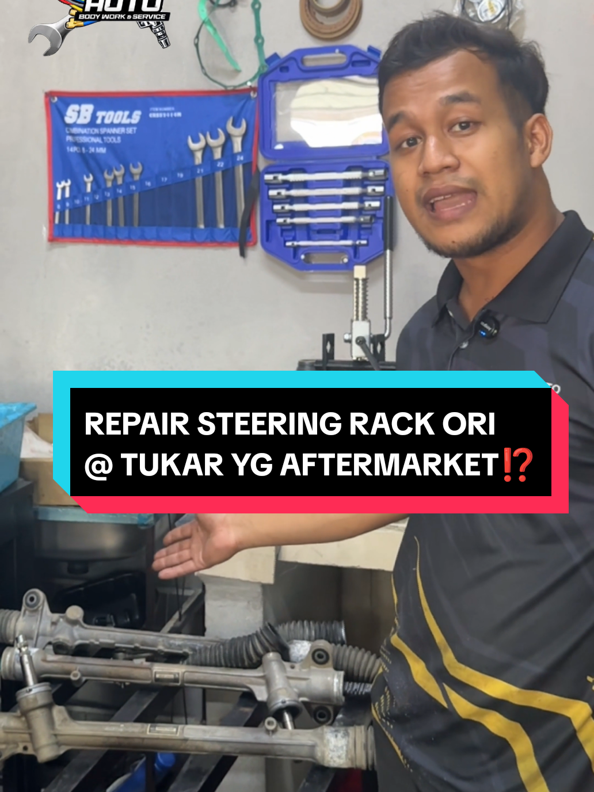
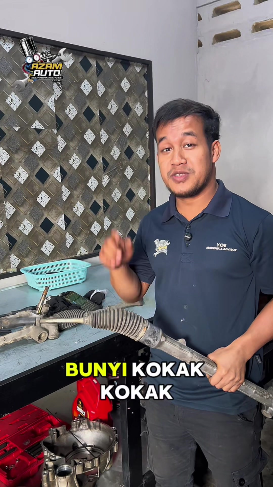

<!DOCTYPE html>
<html lang="ms">
<head>
    <meta charset="UTF-8">
    <meta name="viewport" content="width=device-width, initial-scale=1.0">
    <title>Pakar Steering Rack EPS | Azam Auto Berek 12</title>
    <!-- Tailwind CSS -->
    
    <!-- FontAwesome -->
    <link rel="stylesheet" href="https://cdnjs.cloudflare.com/ajax/libs/font-awesome/6.4.0/css/all.min.css">
    <!-- Google Fonts -->
    <link href="https://fonts.googleapis.com/css2?family=Inter:wght@300;400;600;700;800&display=swap" rel="stylesheet">
    
    
    
    
</head>
<body class="bg-white text-brand-black antialiased">

    <!-- Progress Bar & Top Banner -->
    

        <i class="fas fa-exclamation-circle"></i> PERHATIAN: Langkah 1 daripada 3 - Sila buat pengesahan slot anda hari ini. Hanya 7 Slot Harian Disediakan!
    

    <!-- SECTION 1: HERO SECTION -->
    <header class="relative bg-white pt-12 pb-16 md:pt-24 md:pb-32 overflow-hidden">
        

            
            <!-- Left Copy -->
            

                

                    Stereng Berat?
                    Bergegar?
                    Kluk-Kluk?
                

                
                <h1 class="text-4xl md:text-5xl font-extrabold leading-tight mb-6">
                    Pernahkah Anda Rasa Stereng Kereta Tiba-Tiba Berat, Bergegar Di Lebuhraya, Atau Terdengar Bunyi 'Kluk-Kluk' Setiap Kali Langgar Lubang?
                </h1>
                

                    Awas! Jangan anggap ia perkara biasa. Kerosakan pada sistem Electric Power Steering (EPS) bukan sekadar isu bunyi, ia boleh membahayakan nyawa anda dan keluarga pada bila-bila masa!
                

                
                <ul class="space-y-3 mb-8 font-semibold text-gray-800">
                    <li><i class="fas fa-check-circle text-green-500 mr-2"></i> Pemeriksaan Unit Percuma</li>
                    <li><i class="fas fa-check-circle text-green-500 mr-2"></i> Jaminan Kualiti 3 Bulan</li>
                    <li><i class="fas fa-check-circle text-green-500 mr-2"></i> Pelarasan tayar (Alignment) secara percuma!</li>
                </ul>

                <a href="#harga" class="block text-center w-full md:w-max bg-brand-red text-white font-bold text-xl py-4 px-8 rounded-lg pulse-btn shadow-lg hover:bg-red-700 transition">
                    TEMPAH SLOT PROMOSI SAYA SEKARANG!
                </a>
            

            <!-- Right Video / Visual -->
            

                
LIVE DEMO

                
                

                    
Visual 5 saat menunjukkan stereng bergegar teruk...

                

            

        

        
        <!-- Trust Logos -->
        

            
Dipercayai Untuk Jenama Kenderaan

            

                PERODUA
                PROTON
                TOYOTA
                HONDA
                NISSAN
            

            

                ★★★★★ 4.9/5 Rating Kepuasan Pelanggan
            

        

    </header>

    <!-- SECTION 2: SYMPTOMS -->
    <section class="py-20 bg-brand-gray">
        

            

                <h2 class="text-3xl md:text-4xl font-extrabold mb-4">Adakah Kereta Anda Mengalami Simptom Ini?</h2>
                
Perhatikan petanda amaran sistem Electric Power Steering (EPS) kenderaan anda sebelum ia bertukar menjadi kos membaiki yang merobek poket.

            

            
            

                <!-- Card 1 -->
                

                    

                        <i class="fas fa-dumbbell"></i>
                    

                    <h3 class="font-bold text-lg mb-2">Stereng Berat</h3>
                    
Tiba-tiba sukar membelok ke kiri atau kanan terutama ketika *parking*.

                

                <!-- Card 2 -->
                

                    

                        <i class="fas fa-volume-up"></i>
                    

                    <h3 class="font-bold text-lg mb-2">Bunyi "Kluk-Kluk"</h3>
                    
Bunyi ketukan kasar terutamanya pada model seperti Alza, Myvi, Axia dan Bezza.

                

                <!-- Card 3 -->
                

                    

                        <i class="fas fa-wave-square"></i>
                    

                    <h3 class="font-bold text-lg mb-2">Stereng Bergegar</h3>
                    
Gegaran terasa di tapak tangan, menghilangkan ketenangan sewaktu memandu.

                

                <!-- Card 4 -->
                

                    

                        <i class="fas fa-car-crash"></i>
                    

                    <h3 class="font-bold text-lg mb-2">Tayar Makan Sebelah</h3>
                    
Menyebabkan tayar anda "makan sebelah" dan menghilangkan cengkaman brek.

                

            

        

    </section>

    <!-- SECTION 3: KENAPA IA BERLAKU -->
    <section class="py-20 bg-white">
        

            
            

                
            

            

                <h2 class="text-3xl md:text-4xl font-extrabold mb-4">Mengapa Boleh Rosak?</h2>
                
Iklim dan keadaan jalan di Malaysia sering menyebabkan 3 kerosakan kronik ini:

                

                    

                        
<i class="fas fa-circle-xmark text-brand-red text-xl"></i>

                        

                            <h4 class="font-bold text-lg">① Bushing Plastik Haus & Hancur</h4>
                            
Hentakan berulang pada jalan berlubang akan memampatkan guide bushing (penahan aci), menyebabkan aci (shaft) mula bergetar.

                        

                    

                    

                        
<i class="fas fa-droplet-slash text-brand-red text-xl"></i>

                        

                            <h4 class="font-bold text-lg">② Musuh Utama - Air & Pasir</h4>
                            
Boot getah stereng yang koyak akan membenarkan air hujan membasuh gris pelincir, seterusnya menyebabkan kakisan dan karat yang teruk.

                        

                    

                    

                        
<i class="fas fa-lock text-brand-red text-xl"></i>

                        

                            <h4 class="font-bold text-lg text-brand-red">③ Risiko Maut "Total Steering Lock"</h4>
                            
Ini yang paling menakutkan! Jika dibiarkan, karat dan herotan gear boleh menyebabkan stereng anda tersangkut (jammed) secara tiba-tiba ketika sedang membelok.

                        

                    

                

            

        

    </section>

    <!-- SECTION 4: BEFORE / AFTER SLIDER -->
    <section class="py-20 bg-brand-black text-white text-center">
        

            <h2 class="text-3xl md:text-4xl font-extrabold mb-4">Perbezaan Ketara Kualiti Kami</h2>
            
Berhenti membahayakan nyawa anda. Lihat sendiri beza komponen rosak dan komponen *original refurbished* yang dipasang.

            
            

                <!-- Background Image (After / Clean) -->
                
                <!-- Foreground Image (Before / Rusty) -->
                
                <!-- Range Slider -->
                <input type="range" min="1" max="100" value="50" class="slider" id="compare-slider">
                
                
SEBELUM (BERKARAT)

                
SELEPAS (REFURBISHED)

            

        

    </section>

    <!-- SECTION 5: KENAPA PILIH AZAM AUTO? -->
    <section class="py-20 bg-brand-gray">
        

            <h2 class="text-3xl md:text-4xl font-extrabold mb-4">Kenapa Di Azam Auto Berek 12?</h2>
            
Kami mahu mengembalikan brand Cawangan Berek 12 kami sebagai Pusat Pakar (Speciality) dalam pembaikan dan penukaran steering rack kenderaan EPS anda!

            
            

                <!-- Benefit 1 -->
                

                    
<i class="fas fa-tools"></i>

                    <h4 class="font-bold text-md mb-2">Pakar EPS</h4>
                    
Pusat Pakar Pembaikan Steering Rack

                

                <!-- Benefit 2 -->
                

                    
<i class="fas fa-wallet"></i>

                    <h4 class="font-bold text-md mb-2">Jimat Kos</h4>
                    
Rawat sekarang sebelum kos pembaikan melambung berkali ganda! kami periksa dan tukar apa yang perlu sahaja

                

                <!-- Benefit 3 -->
                

                    
<i class="fas fa-car-side"></i>

                    <h4 class="font-bold text-md mb-2">Rasa Kereta Baru</h4>
                    
Tiada lagi gegaran, kembalikan ketenangan.

                

                <!-- Benefit 4 -->
                

                    
<i class="fas fa-award"></i>

                    <h4 class="font-bold text-md mb-2">Waranti 3 Bulan</h4>
                    
100% tanpa risiko kerugian.

                

                <!-- Benefit 5 -->
                

                    
<i class="fas fa-cog"></i>

                    <h4 class="font-bold text-md mb-2">Unit Refurbished</h4>
                    
Unit alat ganti Original Refurbished.

                

                <!-- Benefit 6 -->
                

                    
<i class="fas fa-tag"></i>

                    <h4 class="font-bold text-md mb-2">Pakej All-In</h4>
                    
Tawaran pakej gila-gila untuk anda.

                

            

        

    </section>

    <!-- SECTION 6: SERVIS KAMI (Timeline) -->
    <section class="py-20 bg-white border-y border-gray-100">
        

            <h2 class="text-2xl md:text-3xl font-extrabold mb-12">Proses Pemasangan Profesional KAMI</h2>
            

                <!-- Line background for desktop -->
                

                
                

                    
<i class="fas fa-search"></i>

                    
Pemeriksaan

                

                

                    
<i class="fas fa-stethoscope"></i>

                    
Diagnos

                

                

                    
<i class="fas fa-wrench"></i>

                    
Tukar Unit

                

                

                    
<i class="fas fa-dharmachakra"></i>

                    
Alignment

                

                

                    
<i class="fas fa-road"></i>

                    
Road Test

                

                

                    
<i class="fas fa-flag-checkered"></i>

                    
Selesai

                

            

            
Kerja pemasangan akan dijalankan dengan berhati-hati secara profesional sehingga kenderaan selamat diserahkan semula kepada pelanggan.

        

    </section>

    <!-- SECTION 7 & 8: PRICING & WHAT YOU GET -->
    <section id="harga" class="py-24 bg-brand-gray relative">
        

            

                <h2 class="text-3xl md:text-5xl font-extrabold mb-4 uppercase">KEMPEN PROMOSI PEMULIHAN KEPAKARAN STEERING RACK EPS</h2>
                
Kami faham, kos penukaran di pusat servis luar sangat mahal. Oleh itu, kami bawakan Tawaran "Pakej All-In".

            

            
            

                
                <!-- Pricing Card 1 -->
                

                    

                        <h3 class="text-2xl font-bold uppercase tracking-wider">Sistem Motor Bawah</h3>
                        
(Rak Stereng)

                    

                    

                        
Harga Asal: RM1,500

                        

                            RM
                            750
                        

                        
                        

                            
<i class="fas fa-check text-green-500 mr-3"></i> Unit alat ganti Original Refurbished

                            
<i class="fas fa-check text-green-500 mr-3"></i> Kos keseluruhan upah dan pemasangan

                            
<i class="fas fa-check text-green-500 mr-3"></i> Pemeriksaan unit percuma

                            
<i class="fas fa-check text-green-500 mr-3"></i> Pelarasan tayar (Alignment) percuma

                        

                        
                        <a href="https://wa.me/60178441058?text=Saya%20nak%20tempah%20slot%20promosi%20Motor%20Bawah%20RM750" class="block w-full bg-brand-red text-white font-bold py-4 rounded-lg shadow-md hover:bg-red-700 transition">
                            TEMPAH SLOT MOTOR BAWAH
                        </a>
                    

                

                <!-- Pricing Card 2 -->
                

                    
PALING LARIS

                    

                        <h3 class="text-2xl font-bold uppercase tracking-wider">Sistem Motor Atas</h3>
                        
(Tiang Stereng)

                    

                    

                        
Harga Asal: RM1,500

                        

                            RM
                            850
                        

                        
                        

                            
<i class="fas fa-check text-green-500 mr-3"></i> Unit alat ganti Original Refurbished

                            
<i class="fas fa-check text-green-500 mr-3"></i> Kos keseluruhan upah dan pemasangan

                            
<i class="fas fa-check text-green-500 mr-3"></i> Pemeriksaan unit percuma

                            
<i class="fas fa-check text-green-500 mr-3"></i> Pelarasan tayar (Alignment) percuma

                        

                        
                        <a href="https://wa.me/60178441058?text=Saya%20nak%20tempah%20slot%20promosi%20Motor%20Atas%20RM850" class="block w-full bg-brand-red text-white font-bold py-4 rounded-lg pulse-btn shadow-lg hover:bg-red-700 transition">
                            TEMPAH SLOT MOTOR ATAS
                        </a>
                    

                

            

            <!-- Cara Tempahan -->
            

                <h4 class="font-bold text-xl mb-4 text-center">Cara Membuat Tempahan:</h4>
                <ol class="list-decimal list-inside space-y-3 text-gray-700 font-medium">
                    <li>Klik butang tempahan di atas untuk ke Payment Gateway.</li>
                    <li>Bayar deposit tempahan (booking) anda secara dalam talian (online).</li>
                    <li>Setelah berjaya, resit bukti pembayaran <strong class="text-brand-red">WAJIB</strong> dihantar terus ke nombor WhatsApp: <a href="https://wa.me/60178441058" target="_blank" class="font-bold underline text-blue-600 hover:text-green-500 transition-colors">+60 17-844 1058</a> untuk pengesahan slot.</li>
                </ol>
                
* Pemasangan tertakluk kepada sistem temujanji (booking) yang diwajibkan bagi mengesahkan slot harian anda.

            

        

    </section>

    <!-- SECTION 9: WARRANTY -->
    <section class="py-16 bg-brand-black text-white text-center reveal">
        

            

                

                    3
                    Bulan
                

            

            <h2 class="text-3xl font-extrabold mb-4 uppercase tracking-wide">Jaminan Kualiti 3 Bulan</h2>
            

                Setiap pemasangan steering rack di Azam Auto Berek 12 didatangkan bersama jaminan kualiti dan waranti selama 3 bulan. Anda memandu dengan tenang, 100% tanpa risiko kerugian (selagi tak okay , datang lagi kami baiki hingga puas hati).
            

        

    </section>

    <!-- SECTION 10: CUSTOMER REVIEW -->
    <section class="py-20 bg-white">
        

            <h2 class="text-3xl md:text-4xl font-extrabold mb-16">Apa Kata Pelanggan Kami?</h2>
            
            

                <!-- Google Review 1 -->
                

                    

                        

                            
Z

                            

                                <h3 class="font-bold text-gray-900 text-sm">Zamzuri Ismail</h3>
                                

                                    <i class="fas fa-star"></i><i class="fas fa-star"></i><i class="fas fa-star"></i><i class="fas fa-star"></i><i class="fas fa-star"></i>
                                

                            

                        

                        
                    

                    
"This another friendly and professional workshop tho. They provides many kinds of automotive services under one roof.. convenient. Best part is, fast service & recovery. The owner I think really friendly, plus the worker as well."

                    <a href="https://maps.app.goo.gl/F3hpPjYBVyvSeVAF9" target="_blank" class="text-blue-600 text-sm font-semibold hover:underline flex items-center gap-1 mt-auto">
                        Baca di Google <i class="fas fa-external-link-alt text-xs"></i>
                    </a>
                

                <!-- Google Review 2 -->
                

                    

                        

                            
S

                            

                                <h3 class="font-bold text-gray-900 text-sm">SYAFIQ HAKIM</h3>
                                

                                    <i class="fas fa-star"></i><i class="fas fa-star"></i><i class="fas fa-star"></i><i class="fas fa-star"></i><i class="fas fa-star"></i>
                                

                            

                        

                        
                    

                    
"Best service from Azam Auto. My car couldn't move due to EPB system jam problem on the first day of Raya Haji... Pomen came directly to my house to solve my car problem. Highly recommended 👍"

                    <a href="https://maps.app.goo.gl/kRtnJzbJgMpfqEB29" target="_blank" class="text-blue-600 text-sm font-semibold hover:underline flex items-center gap-1 mt-auto">
                        Baca di Google <i class="fas fa-external-link-alt text-xs"></i>
                    </a>
                

                <!-- Google Review 3 -->
                

                    

                        

                            
H

                            

                                <h3 class="font-bold text-gray-900 text-sm">hadi die</h3>
                                

                                    <i class="fas fa-star"></i><i class="fas fa-star"></i><i class="fas fa-star"></i><i class="fas fa-star"></i><i class="fas fa-star"></i>
                                

                            

                        

                        
                    

                    
"kedai terbaik bg saya..servis cepat..spare part ada terus x perlu tunggu lama2..ruang menunggu full aircond siap kerusi urut😊 harga pun berpatutan..memang recomended"

                    <a href="https://maps.app.goo.gl/DAgPswXNz6gmorH48" target="_blank" class="text-blue-600 text-sm font-semibold hover:underline flex items-center gap-1 mt-auto">
                        Baca di Google <i class="fas fa-external-link-alt text-xs"></i>
                    </a>
                

            

            <!-- WhatsApp Screenshots Placeholder -->
            

                

                    <i class="fab fa-whatsapp text-4xl mb-2 text-green-500"></i>
                    [Screenshot WhatsApp 1]
                

                

                    <i class="fab fa-whatsapp text-4xl mb-2 text-green-500"></i>
                    [Screenshot WhatsApp 2]
                

                

                    <i class="fab fa-whatsapp text-4xl mb-2 text-green-500"></i>
                    [Screenshot WhatsApp 3]
                

            

        

    </section>

    <!-- SECTION 12: COUNTDOWN TIMER -->
    <section class="py-12 bg-red-50 border-y border-red-100 reveal">
        

            <h2 class="text-2xl font-bold text-brand-red mb-2"><i class="fas fa-stopwatch"></i> AMARAN: TAWARAN TERHAD!</h2>
            

                Promosi jualan runtuh ini hanya sah bermula 8 Julai 2026 sehingga 31 Julai 2026 SAHAJA, khas untuk melepaskan stok sedia ada yang terhad di Berek 12. Harga ini juga HANYA diberikan kepada anda yang membuat tempahan eksklusif menerusi Landing Page ini sahaja!
            

            
            

                

                    00
                    Hari
                

                
:

                

                    00
                    Jam
                

                
:

                

                    00
                    Minit
                

                
:

                

                    00
                    Saat
                

            

        

    </section>

    <!-- SECTION 13: FAQ -->
    <section class="py-20 bg-white">
        

            <h2 class="text-3xl font-extrabold mb-10 text-center">Soalan Lazim (FAQ)</h2>
            
            

                <!-- FAQ 1 -->
                

                    <button class="w-full text-left px-6 py-4 font-bold focus:outline-none flex justify-between items-center bg-white" onclick="toggleAccordion(this)">
                        Adakah harga berubah jika ada kerosakan lain?
                        <i class="fas fa-chevron-down text-brand-red transition-transform duration-300"></i>
                    </button>
                    

                        

                            Kami amat telus. Anda perlu menghubungi Pengurus Cawangan Berek 12 untuk penerangan harga, dan persetujuan anda adalah diwajibkan jika ada sebarang penambahan skop kerja.
                        

                    

                

                
                <!-- FAQ 2 -->
                

                    <button class="w-full text-left px-6 py-4 font-bold focus:outline-none flex justify-between items-center bg-white" onclick="toggleAccordion(this)">
                        Berapa lama proses pemasangan?
                        <i class="fas fa-chevron-down text-brand-red transition-transform duration-300"></i>
                    </button>
                    

                        

                            Kerja pemasangan akan dijalankan dengan berhati-hati secara profesional sehingga kenderaan selamat diserahkan semula kepada pelanggan. Kami akan meminta pelanggan tinggalkan kenderaan di bengkel.
                        

                    

                

            

        

    </section>

    <!-- SECTION 14: GIANT CTA / WARNING -->
    <section class="py-24 bg-brand-black text-white text-center">
        

            <h2 class="text-3xl md:text-5xl font-extrabold mb-6 leading-tight">
                Jangan Tunggu Steering Lock Berlaku Ketika Memandu.
            </h2>
            

                Anda boleh pilih untuk tutup website ini sekarang dan terus memandu dengan steering rack yang berbunyi. Tetapi adakah anda sanggup mempertaruhkan keselamatan keluarga anda sekiranya stereng tersebut tersekat di selekoh esok hari?
            

            
            <a href="#harga" class="inline-block bg-brand-red text-white font-extrabold text-2xl py-6 px-12 rounded-xl pulse-btn shadow-2xl hover:bg-red-700 transition uppercase tracking-wide">
                TEMPAH SLOT PROMOSI SEKARANG
            </a>
        

    </section>

    <!-- SECTION 15: TIKTOK -->
    <section class="py-16 bg-gray-50 border-t border-gray-200">
        

            <i class="fab fa-tiktok text-4xl text-black mb-4"></i>
            <h2 class="text-3xl md:text-4xl font-extrabold mb-8">Ikuti kami di TikTok</h2>
            

                <a href="https://www.tiktok.com/@azamautoberek12/video/7615810579462196498" target="_blank" class="group relative block w-full max-w-[325px] bg-black shadow-lg rounded-2xl overflow-hidden aspect-[9/16] hover:shadow-xl hover:-translate-y-2 transition-all duration-300 mx-auto">
                    
                    

                    

                        

                            <i class="fas fa-play text-2xl text-white ml-1"></i>
                        

                    

                    

                        

                            <i class="fab fa-tiktok text-xl text-[#00f2fe]"></i> Tonton di TikTok
                        

                    

                </a>
                
                <a href="https://www.tiktok.com/@azamautoberek12/video/7649311929923603719" target="_blank" class="group relative block w-full max-w-[325px] bg-black shadow-lg rounded-2xl overflow-hidden aspect-[9/16] hover:shadow-xl hover:-translate-y-2 transition-all duration-300 mx-auto">
                    
                    

                    

                        

                            <i class="fas fa-play text-2xl text-white ml-1"></i>
                        

                    

                    

                        

                            <i class="fab fa-tiktok text-xl text-[#00f2fe]"></i> Tonton di TikTok
                        

                    

                </a>
                
                <a href="https://www.tiktok.com/@azamautoberek12/video/7603400710524374293" target="_blank" class="group relative block w-full max-w-[325px] bg-black shadow-lg rounded-2xl overflow-hidden aspect-[9/16] hover:shadow-xl hover:-translate-y-2 transition-all duration-300 mx-auto">
                    
                    

                    

                        

                            <i class="fas fa-play text-2xl text-white ml-1"></i>
                        

                    

                    

                        

                            <i class="fab fa-tiktok text-xl text-[#00f2fe]"></i> Tonton di TikTok
                        

                    

                </a>
            

        

    </section>

    <!-- FOOTER & MAP -->
    <footer class="bg-gray-100 py-12 text-center text-sm text-gray-500 border-t border-gray-200 pb-24 md:pb-12">
        

            <h4 class="font-bold text-gray-800 text-lg mb-2">AZAM AUTO BODY WORK & SERVICES</h4>
            
Cawangan Berek 12, Kelantan

            
&copy; 2026 Azam Auto. Hak Cipta Terpelihara. Promosi tertakluk kepada Terma & Syarat.

        

    </footer>

    <!-- STICKY CTA (Mobile Only) -->
    

        

            
Bermula Dari

            
RM750

        

        <a href="#harga" class="bg-brand-red text-white font-bold py-3 px-6 rounded-lg text-sm shadow-md pulse-btn whitespace-nowrap">
            TEMPAH SEKARANG
        </a>
    

    <!-- FLOATING WHATSAPP -->
    <a href="https://wa.me/60178441058" class="fixed bottom-24 md:bottom-8 right-4 bg-[#25D366] text-white w-14 h-14 rounded-full flex items-center justify-center text-3xl shadow-2xl hover:scale-110 transition-transform z-50 pulse-btn" style="box-shadow: 0 0 0 0 rgba(37, 211, 102, 0.7); animation: pulse-wa 2s infinite;">
        <i class="fab fa-whatsapp"></i>
    </a>

    

    <!-- SCRIPTS FOR ANIMATIONS -->
    
</body>
</html>